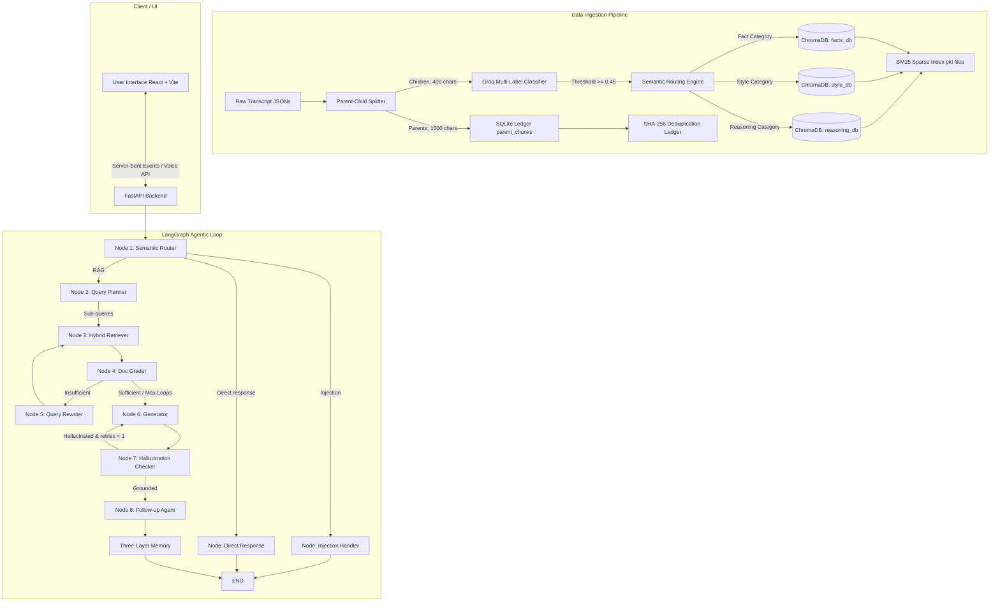

# Anaxee CEO Digital Twin — Detailed Technical Architecture

This document provides a comprehensive technical description of the **CEO Digital Twin** project, a production-grade Agentic Retrieval-Augmented Generation (RAG) platform. The system is designed to simulate the conversational style, reasoning patterns, and business insights of Govind Agrawal, CEO of Anaxee Digital Runners.

---

## 🗺️ System Architecture

The following diagram illustrates the lifecycle of data ingestion, retrieval, agentic routing, and user interaction within the CEO Digital Twin system:



---

## 🛠️ Technology Stack & Dependencies

The project is structured with a Python backend and a React/TypeScript frontend:

### Backend Stack
* **Framework**: FastAPI (async application server) with `uvicorn` and `slowapi` rate limiter.
* **Agentic Graph**: `langgraph` state machines.
* **Vector Databases**: `chromadb` (Persistent Client) with Cosine similarity space.
* **Embedding Model**: `BAAI/bge-base-en-v1.5` (via `sentence-transformers` for local encoding).
* **Sparse Search**: `rank_bm25` (BM25Okapi).
* **Reranking Engine**: `cross-encoder/ms-marco-MiniLM-L-6-v2` (CrossEncoder model).
* **LLM Engine**: Groq API (primarily running `llama-3.1-8b-instant` and `llama-3.3-70b-versatile`).
* **Database Ledger**: SQLite (`sqlite3`) for Parent-Child expansion and duplicate protection.
* **Logging**: `loguru` (structured console and JSON file logging).

### Frontend Stack
* **Build System & Sandbox**: Vite + React (TypeScript).
* **Styles**: Tailwind CSS (sleek, semi-transparent glassmorphism UI).
* **Icons**: Lucide React.
* **APIs Used**: Server-Sent Events (SSE) for token streaming; Web Speech API (native browser speech synthesis and Groq Whisper cloud transcription for voice).
* **Analytics**: PostHog.

---

## 📦 Core Architecture & Technical Details

### 1. Ingestion Pipeline (`ingest.py`)

The ingestion pipeline handles raw JSON transcripts, transforms them into structured data chunks, runs LLM classification, embeds them, and inserts them into databases.

#### Parent-Child Chunking
* **Rationale**: Pure small-chunk search returns highly specific phrases but misses global conversational context. Pure large-chunk search dilutes embeddings and reduces retrieval precision.
* **Implementation**: The [ParentChildSplitter](file:///c:/MISCSSSS%202.0/AREA%2051/rag/data%20injestion%20pipeline/ingest.py#L261-L290) splits documents into parent blocks (~1500 characters, overlap 100) and child chunks (~400 characters, overlap 60).
  * Child chunks are encoded into 768-dimensional vectors using `bge-base-en-v1.5` and written to ChromaDB.
  * Parent chunks are stored in an SQLite relational table mapping `parent_id` to raw text. At query time, retrieved child IDs are expanded to their corresponding full parents.

#### Multi-Label Semantic Routing
Every child chunk is classified into three behavioral aspects:
1. **Fact**: Specific events, locations, decisions, numbers, and historical data.
2. **Style**: Idiomatic phrasing, conversational fillers, analogies, and unique speech signatures.
3. **Reasoning**: Root philosophies, business principles, and logic systems Govind relies on.

A multi-label prompt is run against the chunk using `llama-3.1-8b-instant`. The classifier yields probability scores for all three types:
* Chunks are written to the database collection of any category with a probability $\ge 0.45$.
* This allows a single chunk to reside in multiple DBs simultaneously (e.g., a factual sentence written with a highly distinctive tone will reside in both the `facts_db` and `style_db` collections).
* If no category meets the threshold, the chunk defaults to the highest-scoring category.

#### Deduplication & SQLite Ledger (`ingest_ledger.db`)
To support scalable, incremental ingestion without repetitive embedding fees, the [IngestLedger](file:///c:/MISCSSSS%202.0/AREA%2051/rag/data%20injestion%20pipeline/ingest.py#L81-L187) operates a SQLite database with three schemas:
1. `ingested_files`: Tracks file paths and their SHA-256 hashes.
2. `parent_chunks`: Stores parent IDs and their raw texts.
3. `child_chunks`: Stores child hashes and references to their parent records.

```sql
CREATE TABLE IF NOT EXISTS ingested_files (
    file_path TEXT PRIMARY KEY,
    file_hash TEXT NOT NULL,
    ingested_at REAL NOT NULL,
    chunk_count INTEGER NOT NULL
);
CREATE TABLE IF NOT EXISTS parent_chunks (
    parent_id TEXT PRIMARY KEY,
    source_file TEXT NOT NULL,
    content TEXT NOT NULL,
    metadata_json TEXT NOT NULL,
    ingested_at REAL NOT NULL
);
CREATE TABLE IF NOT EXISTS child_chunks (
    child_hash TEXT PRIMARY KEY,
    parent_id TEXT NOT NULL,
    source_file TEXT NOT NULL,
    chunk_type TEXT NOT NULL,
    chroma_id TEXT NOT NULL,
    ingested_at REAL NOT NULL,
    FOREIGN KEY (parent_id) REFERENCES parent_chunks(parent_id)
);
```

#### Rule-based Persona Quotes Extractor
During ingestion, a rule-based regex script parses chunks for lines beginning with or containing keywords like `statement:`, `quote:`, `belief:`, or `exact_quotes`. It extracts these quotes and writes them to [govind_persona.json](file:///c:/MISCSSSS%202.0/AREA%2051/rag/data%20injestion%20pipeline/data/govind_persona.json) to act as a dynamic anchor in the generator's system prompt.

---

### 2. LangGraph Agent State Machine (`backend/agents/*`)

Conversations are managed by a LangGraph workflow compiled from a state definition ([AgentState](file:///c:/MISCSSSS%202.0/AREA%2051/rag/data%20injestion%20pipeline/backend/agents/graph_state.py)). The graph controls the interaction loops:

#### Nodes and Routing Logic:
1. **`semantic_router`**: Uses `llama-3.1-8b-instant` to check user intent. Combines this with a local regex check to identify prompt injection attacks.
   * If injection is detected $\rightarrow$ Route to `injection_handler`.
   * If the input is conversational (e.g., greetings) $\rightarrow$ Route to `direct_response` (short-circuit retrieval).
   * Otherwise $\rightarrow$ Route to `query_planner` (RAG path).
2. **`query_planner`**: Deconstructs complex queries into up to 3 separate semantic queries (e.g., "What is Anaxee's tier 3 model and who funded them?" is split into query A about funding and query B about tier 3 strategy).
3. **`hybrid_retriever`**: Performs concurrent search (dense + sparse) across the three specialized collections using the generated sub-queries.
4. **`doc_grader`**: Concurrently evaluates the relevance of each retrieved chunk using the fast model. If fewer than 2 relevant documents are found, the state shifts to `insufficient`.
5. **`query_rewriter`**: Runs in the CRAG loop. If the documents are graded as insufficient, the rewriter reformulates the user queries to try and pull better context, resetting the retriever (capped at 2 loops to prevent runaway cycles).
6. **`generator`**: Formulates Govind's response using the structured contexts.
7. **`hallucination_checker`**: The Self-RAG component. Evaluates the generated text against the compiled retrieval context.
   * If it detects unsupported claims, it marks the state as `hallucinated` and routes back to the generator for a single corrective generation attempt.
8. **`follow_up_agent`**: Generates two context-specific follow-up question suggestions for the client and triggers episodic memory saves.

---

### 3. Retrieval Engine (`backend/core/rag_pipeline.py`)

The [TripleHybridRetriever](file:///c:/MISCSSSS%202.0/AREA%2051/rag/data%20injestion%20pipeline/backend/core/rag_pipeline.py#L133-L404) uses parallel dense (ChromaDB Cosine) and sparse (BM25) search across all 3 databases.

```
       Query (Dense Cosine) ────────┐
                                    ├─ RRF Fusion ─→ Cross-Encoder Rerank ─→ Parent Expansion ─→ MMR Diversity ─→ Final Context
       Query (BM25 Lexical Matching) ─┘
```

1. **Dense Retrieval**: chroma queries vector stores using BAAI/bge embeddings.
2. **Sparse Retrieval**: BM25 okapi matches keywords (lowercased query token match).
3. **Reciprocal Rank Fusion (RRF)**: Merges dense and sparse ranks within each database:
   $$\text{RRF Score}(d) = \sum_{m \in M} \frac{1}{60 + \text{Rank}_m(d)}$$
4. **Neural Reranking (CrossEncoder)**: Merges facts, reasoning, and style candidate pools into a single collection, evaluating semantic match with `ms-marco-MiniLM-L-6-v2`. Logit scores are sigmoid-normalized into a $(0, 1)$ confidence metric.
5. **Recency Weighting**: Blends the semantic score ($80\%$) with a temporal decay score ($20\%$) computed from document metadata dates using a 365-day half-life decay function.
6. **Parent Expansion**: Retrieved child IDs are swapped with their 1500-character parents fetched from the SQLite database.
7. **Maximal Marginal Relevance (MMR)**: Enforces diversity by filtering out redundant parent documents using a Jaccard word-overlap similarity index.
8. **Cross-Collection Deduplication**: Multi-label ingestion could pull duplicate chunks across collections. A hashing deduplicator ensures unique context sections.

---

### 4. Groq Key Rotation Pool (`backend/utils/groq_rotator.py`)

Groq APIs impose tight rate limits (TPM/RPM). To ensure enterprise reliability, the backend routes LLM requests through a [GroqKeyPool](file:///c:/MISCSSSS%202.0/AREA%2051/rag/data%20injestion%20pipeline/backend/utils/groq_rotator.py#L19-L167):
* **Load Balance**: Round-robin cycling over multiple API keys configured in `.env`.
* **API Cooldown Handling**: Catching `RateLimitError` (HTTP 429) or status code 429 API exceptions. When a key hits a rate limit, the pool automatically moves it to a 60-second cooldown container, switches to the next active key, and transparently retries the request.
* **Exponential Backoff**: If all keys are concurrently on cooldown, the rotator enforces a backoff delay ($15 \times 2^{\text{attempt}}$ seconds) before retry.
* **Concurrency Throttling**: The ingestion pipeline limits concurrently executing classification tasks to 10 using an `asyncio.Semaphore` to stay below API thresholds.

---

### 5. Three-Layer Memory System (`backend/memory/memory_manager.py`)

The [MemoryManager](file:///c:/MISCSSSS%202.0/AREA%2051/rag/data%20injestion%20pipeline/backend/memory/memory_manager.py#L34-L162) coordinates three distinct layers of context:

1. **Layer 1: Short-term Context (In-Context History)**
   * Captures the last 10 messages from the active thread session, keeping conversational flow alive.
2. **Layer 2: Episodic Memory (Vector Q&A Store)**
   * Stores previous Q&A pairs in a separate ChromaDB collection (`episodic_memory`).
   * At query time, the system uses semantic search to fetch up to 3 similar past exchanges, helping the agent remember what was discussed in previous sessions.
3. **Layer 3: Structured Memory (Persistent Facts)**
   * An SQLite/JSON-backed store that logs discrete key facts extracted from conversational outputs.

---

### 6. Frontend Streaming & UI

The client-side React code implements premium design aesthetics with real-time SSE streaming.

* **SSE Client Hook (`useSSEStream.ts`)**: Rather than waiting for a full HTTP payload, the UI connects to `/api/chat/stream` using an event stream. It reads chunks via a reader loop, rendering:
  * `session`: Captures and pins the conversation UUID.
  * `thinking`: Renders state notifications showing what the backend agent is doing.
  * `token`: Progressively appends streaming words.
  * `done`: Details follow-up chips and populates the source-attribution database container.
* **Voice Hook (`useVoice.ts`)**:
  * **Input**: Captures voice using native device recorders, shipping standard formats to `/api/voice/transcribe` which transcribes using `whisper-large-v3-turbo` with rotating Groq keys.
  * **Output**: If voice mode is active, text generation is restricted to a concise spoken format, and the finished text is spoken back to the user via browser-level `SpeechSynthesis`.
* **Glassmorphism Theme**: Tailored using custom backdrop-blur layers, gradient active borders, and responsive layouts that fit mobile screen sizes.

---

## 🚀 Setup & Execution

### 1. Configure the Environment
Create a `.env` file in the root folder:
```env
# Add multiple keys separated by commas for rate-limit protection
GROQ_API_KEYS=gsk_key_1,gsk_key_2
CORS_ORIGINS=http://localhost:5173
```

### 2. Install Python Dependencies
```powershell
uv sync
```

### 3. Initialize Ingestion
Place transcript JSON records under `data/jsons/` and run the script:
```powershell
# Runs incrementing check (default)
uv run python ingest.py

# Re-embed everything
uv run python ingest.py --force
```

### 4. Spin up the FastAPI Backend Server
```powershell
uv run uvicorn backend.main:app --reload --port 8000
```

### 5. Spin up the Frontend Dev Client
```powershell
cd frontend
npm install
npm run dev
```
